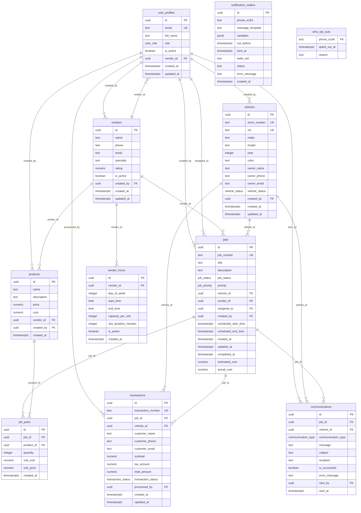

# Entity Relationship Diagram

## Key Relationships

### Core Entities
- **user_profiles**: Central user management with role-based access
- **vendors**: External service providers with capacity management
- **vehicles**: Customer vehicles with stock-first identification
- **jobs**: Work orders/appointments linking vehicles, vendors, and staff

### Business Logic
- **Stock-First Design**: vehicles.stock_number is primary lookup field
- **Job Lifecycle**: pending → scheduled → in_progress → quality_check → completed
- **Vendor Integration**: External vendors can be assigned jobs with time tracking
- **Communication Trail**: All SMS and other communications are logged

### SMS System
- **notification_outbox**: Queue for outbound SMS via Twilio edge functions
- **sms_opt_outs**: Customer preferences for SMS notifications
- **Auto-triggers**: Job status changes automatically enqueue SMS notifications

### Data Flow
1. **Vehicle Entry**: Stock number creates unique vehicle record
2. **Job Creation**: Work orders reference vehicles and can be assigned to vendors
3. **Scheduling**: Jobs get time slots and vendor assignments
4. **Communication**: Status changes trigger SMS via notification queue
5. **Completion**: Jobs close with transaction records and final communications